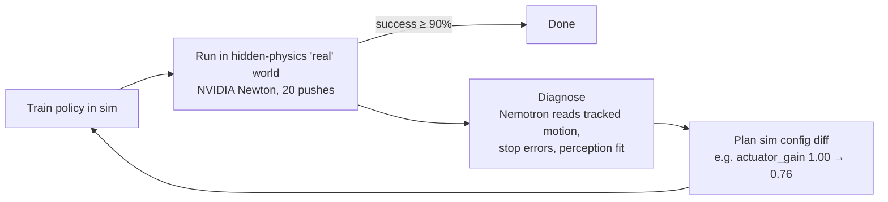

# GapCloser

An agent that closes the Sim2Real gap on its own. When a robot policy trained in simulation fails in the "real" world, GapCloser looks at what happened, works out which simulator parameters are wrong, fixes the simulator, retrains, and measures again until the policy works.

Built for the Nebius × NVIDIA Global AI Hackathon (Physical AI track). Runs on a laptop at zero cost: physics in **NVIDIA Newton**, diagnosis by **NVIDIA Nemotron 3** (Nebius Token Factory, or locally through Ollama for experiments).

## How it works



- **Task (Tier 0):** push a cube so it stops on a target line (20 targets, 0.2–0.6 m, ±3 cm).
- **"Real" world:** a second Newton simulator with up to 10 hidden parameter changes: friction (cube, table), density, size, actuator gain, restitution, camera offset / height / pitch, lighting. The agent never sees these values; it only sees rollouts.
- **Evidence:** end positions, the cube's tracked motion (launch speed and deceleration), and the perceived vs known target positions. Tracking is what separates "the motor is weak" from "the table is sticky", which look identical from end positions alone.
- **Measured, never estimated:** every success rate comes from rolling out the policy. The LLM proposes causes and values; the rollouts grade them.

## Results

Ten random hidden worlds (two changed parameters each), all rollouts in NVIDIA Newton:

| Strategy | Real success | Diagnosis precision / recall |
|---|---|---|
| Domain randomization (all 10 params, full range) | 18% | — |
| Nominal sim, no randomization | 24% | — |
| GapCloser, end positions only | 89% | 0.43 / 1.00 |
| **GapCloser, tracked motion** | **94%** | **1.00 / 1.00** |

Recorded scenarios with Nemotron 3 Nano 30B as the diagnoser (dashboard): slippery cube 0 → 100%, shifted camera 0 → 100%, sticky table 0 → 100%, weak motor 0 → 100% (the end-position-only agent stays at 0%). Each took one fix.

Local Nemotron 3 Nano 4B also diagnosed all five probe worlds correctly, including two simultaneous changes (`actuator_gain=1.2`, `object_mu=0.4` → estimates 1.2 and μ_eff 0.6), at ~2.4k prompt tokens per diagnosis.

**Known limitation:** when effective friction reaches about 1 (the cube's width/height ratio), cubes tip over instead of sliding. The Newton env flags tipped cubes and the diagnosers exclude them, but the agent has no fix for tipping: the "Tipping edge" scenario (table μ 1.18) stays at 5%, while the end-position-only agent, which fits whatever happens, reaches 75%.

## Quickstart

```bash
python3 -m venv .venv && .venv/bin/pip install "newton[examples]" openai pytest
make check            # offline gate: 28 tests, no network
make demo             # record 5 Newton scenarios + build the dashboard (~30 s; add --llm local via eval.record_demo for Nemotron)
open dashboard/dist/gapcloser.standalone.html
```

Benchmark:

```bash
.venv/bin/python -m eval.compare --worlds 10 --env newton
.venv/bin/python -m eval.compare --worlds 10 --llm local          # + Nemotron diagnoser (Ollama)
.venv/bin/python -m eval.compare --worlds 10 --llm tokenfactory   # + Nemotron on Nebius Token Factory
```

LLM providers (`GAPCLOSER_LLM`):

| Provider | Setup | Default diagnose model |
|---|---|---|
| `local` | `ollama pull nemotron-3-nano:4b` (or `:30b`) | Nemotron 3 Nano 30B, override with `--model "nemotron nano 4b"` |
| `tokenfactory` | `NEBIUS_API_KEY`, see [docs/setup/NEBIUS_SETUP.md](docs/setup/NEBIUS_SETUP.md) | Nemotron 3 Super |

Model ids are resolved at runtime from the provider's model list, so no id is hard-coded.

## Repository

| Path | Contents |
|---|---|
| `sim/params.py` | the 10-parameter space, hidden-world sampler, randomization ranges |
| `sim/push_task.py` | analytic surrogate of the push task (policy search, offline tests) |
| `sim/newton_push.py` | NVIDIA Newton push environment, cube tracking, camera clips |
| `agent/loop.py` | the loop, rule-based and trajectory diagnosers, planner, event stream |
| `agent/llm.py`, `agent/llm_diagnoser.py` | OpenAI-compatible client (Token Factory / Ollama), record/replay, Nemotron diagnoser |
| `eval/compare.py`, `eval/record_demo.py` | benchmark and demo recorder |
| `dashboard/` | agent console (template + builder) |
| `docs/` | plan, status, decisions, setup, design reference, submission drafts |

## Credits

Uses NVIDIA Newton (Apache-2.0), NVIDIA Nemotron 3 open models, Nebius Token Factory and Ollama. This project is not affiliated with or endorsed by NVIDIA or Nebius.

License: Apache-2.0.
