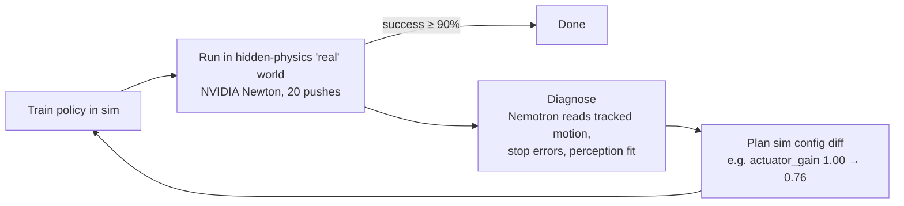

# GapCloser

An agent that closes the Sim2Real gap on its own. When a robot policy trained in simulation fails in the "real" world, GapCloser looks at what happened, works out which simulator parameters are wrong, fixes the simulator, retrains, and measures again until the policy works.

Built for the Nebius × NVIDIA Global AI Hackathon (Physical AI track). Runs on a laptop at zero cost: physics in **NVIDIA Newton**, diagnosis by **NVIDIA Nemotron 3** (Nebius Token Factory, or locally through Ollama for experiments).

## How it works



- **Task (Tier 0):** push a cube so it stops on a target line (20 targets, 0.2–0.6 m, ±3 cm).
- **"Real" world:** a second Newton simulator with up to 10 hidden parameter changes: friction (cube, table), density, size, actuator gain, restitution, camera offset / height / pitch, lighting. The agent never sees these values; it only sees rollouts.
- **Evidence:** end positions, the cube's tracked motion (launch speed and deceleration), and the perceived vs known target positions. Tracking is what separates "the motor is weak" from "the table is sticky", which look identical from end positions alone.
- **Measured, never estimated:** every success rate comes from rolling out the policy. The LLM proposes causes and values; the rollouts grade them.

## Results

Cost on Nebius Token Factory (measured): Nemotron 3 Super is $0.30 / $0.90 per 1M input / output tokens; one diagnosis uses about 1.2k input and 1.0k output tokens (≈ $0.0013). The full 10-world benchmark cost about $0.015 and recording all five demo scenarios plus benchmark about $0.03.

Nemotron runs at temperature 0.2, so its numbers vary between runs; both runs are shown. The rule-based rows are deterministic.

Ten random hidden worlds (two changed parameters each), all rollouts in NVIDIA Newton:

| Strategy | Real success | Diagnosis precision / recall |
|---|---|---|
| Domain randomization (all 10 params, full range) | 18% | — |
| Nominal sim, no randomization | 24% | — |
| GapCloser, end positions only (rule-based) | 80% | 0.42 / 1.00 |
| GapCloser, tracked motion (rule-based) | 96% | 1.00 / 1.00 |
| GapCloser, Nemotron 3 Nano 30B (local, Ollama) | 93–99% (two runs) | 0.89–0.94 / 1.00 |
| **GapCloser, Nemotron 3 Super 120B (Nebius Token Factory)** | **93–94%** (two runs) | 0.89–0.94 / 1.00 |

Recorded scenarios with Nemotron 3 Super 120B on Nebius Token Factory as the diagnoser (dashboard; clips show a Franka FR3 arm, kinematic via IK, striking a cube simulated in Newton): slippery cube 0 → 100%, shifted camera 0 → 100%, sticky table 0 → 100%, weak motor 0 → 100% (the end-position-only agent stays at 0%). Each took one fix.

Local Nemotron 3 Nano 4B also diagnosed all five probe worlds correctly, including two simultaneous changes (`actuator_gain=1.2`, `object_mu=0.4` → estimates 1.2 and μ_eff 0.6), at ~2.4k prompt tokens per diagnosis.

**Known limitation:** when effective friction reaches about 1 (the cube's width/height ratio), cubes tip over instead of sliding. The Newton env flags tipped cubes and the diagnosers exclude them, but the agent has no fix for tipping: results on the "Tipping edge" scenario (table μ 1.18) swing between runs: 5–40% with local Nano 30B, 85% with Super 120B on Token Factory, vs 75% for the end-position-only agent, which fits whatever happens.

## Quickstart

```bash
python3 -m venv .venv && .venv/bin/pip install -r requirements.txt pytest httpx
make check            # offline gate: 37 tests, no network
make demo             # record 5 Newton scenarios + build the dashboard (~30 s; add --llm local via eval.record_demo for Nemotron)
open dashboard/dist/gapcloser.standalone.html
make replays          # 3D viewer data only: per-frame Newton poses for the recorded bundle (no LLM)
```

The dashboard's main visual is a three.js 3D replay of each measured push: per-frame cube and Franka FR3 link poses recorded from NVIDIA Newton, the hidden-physics cube solid and the agent's sim cube as a ghost (or split view), with orbit, scrub, speed, a lane close-up and the stop error vs the target line. three.js and the decimated Franka meshes are inlined, so the standalone page works offline; the WebP camera clips remain as a fallback.

Live demo server (visitors hide physics and watch the agent):

```bash
make serve                      # http://localhost:8000, add GAPCLOSER_LLM=local|tokenfactory|none
make docker && docker run --rm -p 7860:7860 -e NEBIUS_API_KEY=$NEBIUS_API_KEY gapcloser
```

Deployment to Hugging Face Spaces (free), a Nebius CPU VM, or GitHub Pages: [docs/deploy/DEPLOY.md](docs/deploy/DEPLOY.md).

Static page and demo video:

```bash
make site     # site/index.html, self-contained (recorded runs + clips)
make video    # video/out/gapcloser_demo.mp4: dashboard captures + Newton clips + narration (Chrome, ffmpeg, macOS say)
```

Benchmark:

```bash
.venv/bin/python -m eval.compare --worlds 10 --env newton
.venv/bin/python -m eval.compare --worlds 10 --llm local          # + Nemotron diagnoser (Ollama)
.venv/bin/python -m eval.compare --worlds 10 --llm tokenfactory   # + Nemotron on Nebius Token Factory
```

LLM providers (`GAPCLOSER_LLM`):

| Provider | Setup | Default diagnose model |
|---|---|---|
| `local` | `ollama pull nemotron-3-nano:4b` (or `:30b`) | Nemotron 3 Nano 30B, override with `--model "nemotron nano 4b"` |
| `tokenfactory` | `NEBIUS_API_KEY`, see [docs/setup/NEBIUS_SETUP.md](docs/setup/NEBIUS_SETUP.md) | Nemotron 3 Super |

Model ids are resolved at runtime from the provider's model list, so no id is hard-coded.

## Cosmos eyes (optional, local)

Built on NVIDIA Cosmos. `agent/cosmos_eyes.py` asks **NVIDIA Cosmos Reason 2 8B** what happened in each real clip
(`slid 0.17 s → tipped 0.69 s`). It runs locally in llama.cpp at no cost, takes about 4 to 6 s per clip on an M4 Max, and uses about 9 GB of unified memory.
The pipeline tracks the cube, sends 8 close-up crops, asks per frame "is the cube tilted?" at temperature 0 with no `<think>`, and
builds the events in code. Cosmos is a **second opinion** next to Newton's `tipped` flag and never replaces it. In the spike
([spike/cosmos/README.md](spike/cosmos/README.md)) it scored 88% slid-vs-tipped overall, but held-out tip recall was only 6/12, and it almost never reports a false tip.
On the 21 real clips in `runs/demo` it agrees with the physics flag 21/21 (5/5 tips, 0 false tips).

```bash
brew install llama.cpp
mkdir -p ~/models/cosmos-reason2-8b && cd ~/models/cosmos-reason2-8b
B=https://huggingface.co/mradermacher/Cosmos-Reason2-8B-GGUF/resolve/main
curl -LO $B/Cosmos-Reason2-8B.Q4_K_M.gguf && curl -LO $B/Cosmos-Reason2-8B.mmproj-f16.gguf   # 6.2 GB, no account
llama-server -m Cosmos-Reason2-8B.Q4_K_M.gguf --mmproj Cosmos-Reason2-8B.mmproj-f16.gguf \
  -ngl 99 -c 8192 --cache-ram 0 -np 1 --port 8080

# back in the repo
.venv/bin/python -m eval.record_demo --eyes-only     # annotate the existing bundle's real clips (no LLM, no reruns)
.venv/bin/python -m eval.record_demo --eyes cosmos   # record with eyes; the tool agent also gets "camera_events"
GAPCLOSER_EYES=cosmos make serve                     # live server with eyes
make dashboard
```

Each real clip gets `clip["eyes"]` (model, events, per-frame flags, seconds) and `clip["physics"]` (Newton's peak-tilt `tipped`
and first tip time). The dashboard shows an event strip under the 3D viewer with ✓ agrees / ⚠ disagrees against the physics flag. When the server is
down, `CosmosEyes.available()` is False and `events()` returns `[]`. The default is `--eyes none`, so `make check`, CI and the benchmarks
never need the model. The model is `nvidia/Cosmos-Reason2-8B` under the NVIDIA Open Model License (community GGUF quantization, local inference
only, no weights redistributed).

## Repository

| Path | Contents |
|---|---|
| `sim/params.py` | the 10-parameter space, hidden-world sampler, randomization ranges |
| `sim/push_task.py` | analytic surrogate of the push task (policy search, offline tests) |
| `sim/newton_push.py` | NVIDIA Newton push environment, cube tracking, camera clips |
| `sim/replay.py` | per-frame Newton poses (cube + Franka links) for the 3D viewer |
| `agent/loop.py` | the loop, rule-based and trajectory diagnosers, planner, event stream |
| `agent/cosmos_eyes.py` | optional Cosmos Reason 2 eyes: clip to events via a local llama-server |
| `agent/llm.py`, `agent/llm_diagnoser.py` | OpenAI-compatible client (Token Factory / Ollama), record/replay, Nemotron diagnoser |
| `eval/compare.py`, `eval/record_demo.py` | benchmark and demo recorder |
| `dashboard/` | agent console (template + builder; static and live variants), three.js 3D replay viewer, `assets/` (vendored three.js r160, decimated Franka FR3 meshes) |
| `server/app.py` | live server: FastAPI, SSE event stream, cost guards |
| `Dockerfile`, `deploy/`, `docs/deploy/` | container and deployment guides |
| `video/make_video.py` | demo video builder (numbers in the narration come from the recorded bundle) |
| `docs/` | plan, status, decisions, setup, design reference, submission drafts |

## Credits

Uses NVIDIA Newton (Apache-2.0), NVIDIA Nemotron 3 open models, NVIDIA Cosmos Reason 2 (NVIDIA Open Model License; Built on NVIDIA Cosmos), Nebius Token Factory and Ollama. This project is not affiliated with or endorsed by NVIDIA or Nebius.

License: Apache-2.0.
