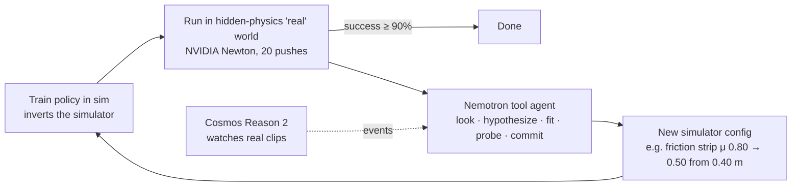

# GapCloser

**An agent that fixes the simulator when a robot fails in the real world, and can tell you why.**

A policy trained in simulation fails on the real robot because the simulator is wrong in ways nobody wrote down: a slippery strip on the table, a weak motor, a distorted camera lens. GapCloser runs the loop an engineer runs by hand. It measures the failures, works out what is wrong with the simulator, designs extra experiments when the data cannot decide, fixes the simulator, retrains and measures again.

Built for the Nebius × NVIDIA Global AI Hackathon (Physical AI track). Runs on a laptop at near-zero cost:

- Physics: **NVIDIA Newton**
- Reasoning: **NVIDIA Nemotron 3** on **Nebius Token Factory**
- Eyes: **NVIDIA Cosmos Reason 2**, running locally (optional)

## How it works



**Task:** a Franka arm pushes a cube so that it stops on a target line. There are 20 targets between 0.2 and 0.6 m, and a push succeeds if the cube stops within ±3 cm.

**The "real" world:** a second Newton world whose physics is hidden from the agent.

- *Closed-world* faults change one of 10 known parameters, such as friction, density, actuator gain or camera pose.
- *Open-world* faults are effects a rule book has no parameter for:
  - a **table strip with different friction**, implemented in Newton without geometry seams
  - **lens distortion**
  - combinations of these

**The agent never sees the hidden values.** It sees only what a real robot would log: where each cube stopped, camera tracks of the cube, and perceived vs known target positions. It can also pay for extra real pushes.

**Nemotron as a scientist:** Nemotron 3 Super on Token Factory works through tool calls. Each step is shown in the dashboard's lab notebook.

1. `decel_profile` and `perception_check` look at the evidence.
2. The agent proposes model *structures* (uniform friction, gain, a friction strip, camera offset, lens).
3. `fit_hypothesis` fits each structure's numbers by least squares. The LLM chooses the structure and the optimizer does the arithmetic.
4. `probe_real` designs extra real pushes when the data does not cover the target range.
5. `commit` hands over a simulator to retrain on.

**Measured, never estimated:** every success rate comes from rolling the policy out in the hidden world.

## Results

### Gap-Bench (NVIDIA Newton, 15 hidden worlds per tier, mean real success ± 95% CI)

| Tier | Nominal sim | Domain rand. | Rule-based agent | System-ID baseline | **Nemotron tool agent** |
|---|---|---|---|---|---|
| Closed: 2 of the 10 known params | 46% | 0% | 100% | 100% | **100%** |
| Open: friction strip or lens + 1 param | 39% | 6% | 83% ±9 | 100% | **100%** |
| Compound: strip + lens + 1 param | 22% | 14% | 54% ±15 | 97% ±4 | **96% ±6** |

- **Rule-based tuning breaks outside its map.** The rule-based agent adjusts a fixed set of known parameters from tracked motion, and it stays at 54–83% when the world has effects it has no parameter for.
- **The Nemotron agent closes those gaps** in about 2 iterations, using about 40–50 real pushes.
- **Honest comparison:** the System-ID baseline fits a hand-ordered library of model structures with the same least-squares fitter and matches the agent. A smaller 6-worlds-per-tier run showed the agent ahead on compound worlds (99% vs 93%), but that gap disappeared at 15 worlds per tier. So the claim is not "LLM beats system identification". It is that Nemotron reaches system-ID accuracy **on its own**:
  - it chooses which structures to try
  - it designs its own experiments
  - it explains every fix in plain language
  - it costs about **$0.007 per world** on Token Factory

Nemotron family on the open and compound tiers (Newton, 6 worlds each; indicative):

| Model (Token Factory) | Open | Compound | Cost for 12 worlds |
|---|---|---|---|
| **Nemotron 3 Super 120B** | 100% | 99% | ~$0.07 |
| Nemotron 3.5 Lightning | 100% | 95% | ~$0.04 |
| Nemotron 3 Ultra 550B | 100% | 83% | ~$0.52 |
| Nemotron 3 Nano 30B | 97% | 53% | ~$0.14 |

### Recorded scenarios (dashboard)

All of these were recorded with Nemotron 3 Super on Token Factory and run in Newton.

| Scenario | Hidden change | Before → after | Rule-based | System-ID |
|---|---|---|---|---|
| Wet strip | μ 0.80 → 0.40 beyond 0.35 m | 50% → **100%** | 50% | 100% |
| Rough strip | table μ 0.65, strip 0.90 beyond 0.30 m | 35% → **100%** | 65% | 100% |
| Lens distortion | k = −0.30 /m | 25% → **100%** | 65% | 100% |
| Three faults | weak motor, strip, lens | 0% → **100%** | 80% | 100% |

In *Three faults*, the agent's first model fit the data perfectly. But the real pushes only reached 0.40 m, so the agent spent 3 probe pushes past that point. Its model then missed by 5.75 cm, so it added a friction strip at 0.40 m with μ 0.50 and the error dropped to 0.06 cm. The hidden truth was 0.40 m and μ 0.50.

The closed-world scenarios (slippery cube, shifted camera, sticky table, weak motor) also close from 0% to 100%.

**Known limitation:** near effective friction 1, cubes tip over instead of sliding. On the tipping-edge scenario the agent reaches 85%. Cosmos Reason 2 reports the tips from video as a second opinion: it agrees with Newton on 21 of 21 demo clips, but caught only about half of the tips on unseen clips.

## Quickstart

```bash
python3 -m venv .venv && .venv/bin/pip install -r requirements.txt pytest httpx
make check            # offline gate: 67 tests, no network, no credits
make demo             # record 5 Newton scenarios + build the dashboard (~30 s; add --llm local via eval.record_demo for Nemotron)
open dashboard/dist/gapcloser.standalone.html
make replays          # 3D viewer data only: per-frame Newton poses for the recorded bundle (no LLM)
```

The dashboard's main visual is a three.js 3D replay of each measured push: per-frame cube and Franka FR3 link poses recorded from NVIDIA Newton, the hidden-physics cube solid and the agent's sim cube as a ghost (or split view), with orbit, scrub, speed, a lane close-up and the stop error vs the target line. three.js and the decimated Franka meshes are inlined, so the standalone page works offline; the WebP camera clips remain as a fallback.

Live demo server (visitors hide physics and watch the agent):

```bash
make serve                      # http://localhost:8000, add GAPCLOSER_LLM=local|tokenfactory|none
make docker && docker run --rm -p 7860:7860 -e NEBIUS_API_KEY=$NEBIUS_API_KEY gapcloser
```

Deployment to Hugging Face Spaces (free), a Nebius CPU VM, or GitHub Pages: [docs/deploy/DEPLOY.md](docs/deploy/DEPLOY.md).

Static page and demo video:

```bash
make site     # site/index.html, self-contained (recorded runs + clips)
make video    # video/out/gapcloser_demo.mp4: dashboard captures + Newton clips + narration (Chrome, ffmpeg, macOS say)
```

Benchmarks:

```bash
.venv/bin/python -m eval.open_bench --worlds 15 --env newton --llm tokenfactory   # Gap-Bench (open-world tiers)
.venv/bin/python -m eval.open_bench --worlds 6 --llm none                         # offline: rule + System-ID only
.venv/bin/python -m eval.record_demo --open-only --llm tokenfactory               # re-record the open-world scenarios
.venv/bin/python -m eval.compare --worlds 10 --env newton
.venv/bin/python -m eval.compare --worlds 10 --llm local          # + Nemotron diagnoser (Ollama)
.venv/bin/python -m eval.compare --worlds 10 --llm tokenfactory   # + Nemotron on Nebius Token Factory
```

LLM providers (`GAPCLOSER_LLM`):

| Provider | Setup | Default diagnose model |
|---|---|---|
| `local` | `ollama pull nemotron-3-nano:4b` (or `:30b`) | Nemotron 3 Nano 30B, override with `--model "nemotron nano 4b"` |
| `tokenfactory` | `NEBIUS_API_KEY`, see [docs/setup/NEBIUS_SETUP.md](docs/setup/NEBIUS_SETUP.md) | Nemotron 3 Super |

Model ids are resolved at runtime from the provider's model list, so no id is hard-coded.

## Cosmos eyes (optional, local)

Built on NVIDIA Cosmos. `agent/cosmos_eyes.py` asks **NVIDIA Cosmos Reason 2 8B** what happened in each real clip
(`slid 0.17 s → tipped 0.69 s`). It runs locally in llama.cpp at no cost, takes about 4 to 6 s per clip on an M4 Max, and uses about 9 GB of unified memory.
The pipeline tracks the cube, sends 8 close-up crops, asks per frame "is the cube tilted?" at temperature 0 with no `<think>`, and
builds the events in code. Cosmos is a **second opinion** next to Newton's `tipped` flag and never replaces it. In the spike
([spike/cosmos/README.md](spike/cosmos/README.md)) it scored 88% slid-vs-tipped overall, but held-out tip recall was only 6/12, and it almost never reports a false tip.
On the 21 real clips in `runs/demo` it agrees with the physics flag 21/21 (5/5 tips, 0 false tips).

```bash
brew install llama.cpp
mkdir -p ~/models/cosmos-reason2-8b && cd ~/models/cosmos-reason2-8b
B=https://huggingface.co/mradermacher/Cosmos-Reason2-8B-GGUF/resolve/main
curl -LO $B/Cosmos-Reason2-8B.Q4_K_M.gguf && curl -LO $B/Cosmos-Reason2-8B.mmproj-f16.gguf   # 6.2 GB, no account
llama-server -m Cosmos-Reason2-8B.Q4_K_M.gguf --mmproj Cosmos-Reason2-8B.mmproj-f16.gguf \
  -ngl 99 -c 8192 --cache-ram 0 -np 1 --port 8080

# back in the repo
.venv/bin/python -m eval.record_demo --eyes-only     # annotate the existing bundle's real clips (no LLM, no reruns)
.venv/bin/python -m eval.record_demo --eyes cosmos   # record with eyes; the tool agent also gets "camera_events"
GAPCLOSER_EYES=cosmos make serve                     # live server with eyes
make dashboard
```

Each real clip gets `clip["eyes"]` (model, events, per-frame flags, seconds) and `clip["physics"]` (Newton's peak-tilt `tipped`
and first tip time). The dashboard shows an event strip under the 3D viewer with ✓ agrees / ⚠ disagrees against the physics flag. When the server is
down, `CosmosEyes.available()` is False and `events()` returns `[]`. The default is `--eyes none`, so `make check`, CI and the benchmarks
never need the model. The model is `nvidia/Cosmos-Reason2-8B` under the NVIDIA Open Model License (community GGUF quantization, local inference
only, no weights redistributed).

## Repository

| Path | Contents |
|---|---|
| `sim/params.py` | 10 closed + 3 open-world parameters, hidden-world sampler, randomization ranges |
| `sim/push_task.py` | analytic surrogate (friction strip, lens), `InverseTrainer` policy, offline tests |
| `sim/newton_push.py` | NVIDIA Newton push environment, cube tracking, camera clips |
| `sim/replay.py` | per-frame Newton poses (cube + Franka links) for the 3D viewer |
| `agent/loop.py` | the loop, rule-based and trajectory diagnosers, planner, event stream |
| `agent/tool_agent.py` | Nemotron tool agent: decel profile, perception check, fit/test hypothesis, probe real robot, commit |
| `agent/cosmos_eyes.py` | optional Cosmos Reason 2 eyes: clip to events via a local llama-server |
| `agent/llm.py`, `agent/llm_diagnoser.py` | OpenAI-compatible client (Token Factory / Ollama), record/replay, Nemotron diagnoser |
| `eval/open_bench.py` | Gap-Bench: closed/open/compound tiers, rule and System-ID baselines, CIs |
| `eval/compare.py`, `eval/record_demo.py` | closed-world benchmark and demo recorder |
| `runs/bench/` | recorded Gap-Bench results (Token Factory) |
| `dashboard/` | agent console (template + builder; static and live variants), three.js 3D replay viewer, `assets/` (vendored three.js r160, decimated Franka FR3 meshes) |
| `server/app.py` | live server: FastAPI, SSE event stream, cost guards |
| `Dockerfile`, `deploy/`, `docs/deploy/` | container and deployment guides |
| `video/make_video.py` | demo video builder (numbers in the narration come from the recorded bundle) |
| `docs/` | plan, status, decisions, setup, design reference, submission drafts |

## Credits

Uses NVIDIA Newton (Apache-2.0), NVIDIA Nemotron 3 open models, NVIDIA Cosmos Reason 2 (NVIDIA Open Model License; Built on NVIDIA Cosmos), Nebius Token Factory and Ollama. This project is not affiliated with or endorsed by NVIDIA or Nebius.

License: Apache-2.0.
