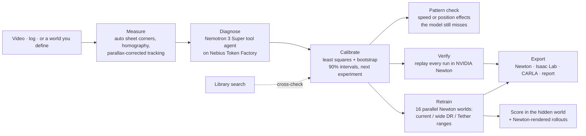
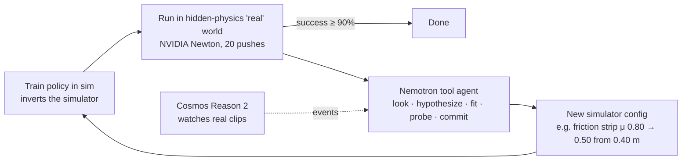

# Tether

**Tie your simulator to the real world.** Tether reads how things really slide and stop, from a phone video or the
log a robot, car or production line already writes. It finds which physics the simulator gets wrong, says how sure
that is, checks the fix by replaying every run in NVIDIA Newton, and exports configs for NVIDIA Newton, Isaac Lab
and CARLA.

One physics model (launched, sliding to a stop; part of the surface differs; the actuator under-delivers; a camera
judges distance) covers three domains:

| Domain | Scene | What Tether finds | Exports |
|---|---|---|---|
| Robot manipulation | an arm pushes a box onto a line | table friction, a wet patch, arm strength, camera tilt | Newton, Isaac Lab |
| Autonomous vehicles | a car brakes to a stop line (Froude-scaled 1:25, full-size units) | tire-road friction, a wet or icy section, speed control, camera pitch | Newton, CARLA, Isaac Lab |
| Factory inspection | a pusher slides a part to the inspection camera | part-rail friction, an oily section, pusher strength, camera tilt | Newton, Isaac Lab |

Built for the Nebius × NVIDIA Global AI Hackathon (Physical AI track). Runs on a laptop at near-zero cost:

- Physics and rendering: **NVIDIA Newton** (Warp, CPU)
- Reasoning: **NVIDIA Nemotron 3 Super** on **Nebius Token Factory**, also runnable as an **NVIDIA NeMo Agent
  Toolkit** workflow (`integrations/nat_tether`)
- Eyes: **NVIDIA Cosmos Reason 2**, running locally (optional)

`make serve`, then open:

| URL | Page |
|---|---|
| http://localhost:8000/ | Overview: the route, the three domains, the evidence |
| http://localhost:8000/console | Agent console: Nemotron fixing hidden worlds, Gap-Bench |
| http://localhost:8000/studio | Studio, in three steps: Data (example, simulate, or upload) → Analysis (tracking, then the agent) → Results (calibrated sim, retrain in parallel Newton worlds, export with a Newton replay) |



Plain-Korean guides live in `reference/`. Submission text: `docs/submission/DEVPOST.md`.
`make prove` recomputes every headline number offline in about five minutes (`runs/proof/PROOF.md`);
`make video` rebuilds the demo video (needs `make serve`).

## Tether Studio: calibrate from your own data

The agent loop above runs against a hidden simulated world. **Studio** points the same machinery at
measurements you bring, and hands back a simulator you can use:

1. **Data.** Upload a phone video of an object flicked across your table, with a sheet of A4 or Letter paper
   lying beside the path. Or upload the push log your robot already writes (CSV/JSON).
2. **Measure.** Drag four handles onto the sheet's corners. From the sheet alone, Studio recovers the camera's
   focal length, height and angle. It tracks the object, corrects for the parallax of the object's own height,
   splits the video into pushes and measures each launch speed and slide in metres.
3. **Diagnose.** Nemotron 3 Super works through your pushes with the same tools as the agent loop. It cannot
   push a real robot from here, so the pushes it asks for become *next experiment* cards. A cross-check fits a
   fixed library of model structures and overrules the agent if its model leaves evidence unexplained.
4. **Calibrated sim.** You get:
   - the physics that differs from your simulator, each value with a 90% interval (bootstrap over your pushes);
   - the measured friction painted onto your own video frame;
   - predicted success of a policy trained in the old vs calibrated simulator. Stretches of table that no push
     reached are treated as unknown (±30% what-ifs), so the prediction is not falsely certain.
5. **Next experiment.** It names the pushes where plausible models still disagree, within your working range.
6. **Export.** A snippet for NVIDIA Newton (`ShapeConfig` mu and the friction region), an Isaac Lab
   `EventTermCfg` whose domain-randomization ranges are the measured intervals, a Markdown report and JSON.

**No video at hand?** Studio can simulate the table. Set the hidden physics with sliders:

- friction;
- a region of different friction;
- for robot logs, the motor strength and the camera tilt.

NVIDIA Newton then renders a phone-style video or writes a robot log. Studio diagnoses it without seeing your
settings, can run the pushes it asks for in the same simulated world, and finally reveals your settings as
ground truth.

The console and the Studio are in English by default; the **EN / KO** switch in the top bar (or `?lang=ko`)
shows them in Korean. **Ask** (bottom right in the Studio) answers questions about the page and your result,
using NVIDIA Nemotron on Token Factory, grounded in the session's numbers and answering in the chosen language.

```bash
make serve                    # then open http://localhost:8000/studio
python -m studio calibrate my_robot_log.csv --llm tokenfactory --out runs/studio/mine
python -m studio video clip.mp4 --corners 409,368,536,439,649,330,534,287 --llm tokenfactory
```

**Samples, with ground truth revealed after the diagnosis.** The two-take phone video is rendered by NVIDIA
Newton's `SensorTiledCamera` from a world Studio never sees, and is labelled synthetic everywhere. Results
from the API with Nemotron 3 Super on Token Factory:

| Sample | Measured (90% interval) | Hidden truth |
|---|---|---|
| Phone video, take 1 (7 flicks, reach 0.46 m) | friction 0.553 (0.542–0.574); slick region from ~0.36 m, still wide (0.33–0.43), its friction not yet pinned down (0.03–0.32); headline shown as a range because part of the table is unmeasured | 0.55; region from 0.364 m*, μ 0.30 |
| Phone video, + take 2 (the 4 longer pushes it asked for) | 0.553 (0.541–0.565); region from 0.362 m (0.348–0.380), μ 0.302 (0.293–0.312) | 0.55; 0.364 m*; 0.30 |
| Robot log, lab bench (20 pushes) | friction 0.701 (0.691–0.708), gain 0.875 (0.864–0.885), region 0.377 m / μ 0.453, camera pitch 2.3° (−3.1–4.8: the agent also freed lens distortion and camera offset, which trade off against pitch) | 0.70, 0.88, 0.38 m / 0.45, 2.0° |
| Robot log, short pushes only (reach 0.29 m) | friction 0.609 (0.59–0.64), gain 1.00. Nemotron proposed a slick region at 0.25 m; the cross-check left it out (it improved the stops by 0.8 mm, within noise). Asks for pushes to 0.47–0.64 m | 0.60; region from 0.33 m, never reached |

\* Measured from the median release point of take 1, which is 0.4 cm behind the simulator origin.

21 of the 22 hidden values of the six Studio examples lie inside their 90% intervals (`make prove`); the pusher log's oily-section start is estimated at 0.291 m (truth 0.300 m) and its interval stops 0.1 mm short. The intervals refit on resampled pushes, and for video each
resample also redraws the systematic error: sheet scale ±1%, tracked speed ±1.5% and stop ±3 mm. Without that
term the take-2 intervals were too narrow and missed the truth.

Tracking on the sample video: slides are within 1 mm of Newton's and launch speeds within 0.6% rms. Camera
recovery from the sheet gives 0.481 m height and 579 px focal length (true: 0.48 m, 579 px). Each sample costs
8–20 Nemotron calls on Token Factory.

**Limits, measured.** A harsher render of the same scene adds a textured table, hand-held shake, motion blur
and heavy compression, all at 30 fps. On it, stops stay within about 4 cm, but launch speeds read 10–15% low
and the friction region is not pinned down. Film in slow motion or at 60 fps. On 52 public real clips (IDPP,
`make real-check`) the tracker follows 45 and constant deceleration fits each tracked slide (median R² 0.9985), but
without a size reference or known frame rate the friction value itself is not identified (error 0.068 vs 0.058 for
guessing the mean). Real objects with independently measured friction: see the EV-RealPhys benchmark below.

### Data from a different engine: MuJoCo hidden worlds (`make cross-engine`)

Tether fits a Newton-family model, so data made by Newton only checks self-consistency. Here every "real" push comes
from **MuJoCo** instead: soft contacts, and a paddle that pushes the object up to speed rather than an assigned
velocity. In three of the four conditions, the world also has an effect the fitter has no field for. 24 random hidden
worlds per condition. The robot's first-day log (14 aimed pushes + 4 probes) is analysed offline. Then a policy is
trained in each simulator and run in the hidden MuJoCo world (24 targets, ±3 cm):

| Hidden world (MuJoCo) | Current sim | Domain randomization, best width | DR over the hidden worlds' own distribution* | Exact hidden parameters | **Tether** (95% CI) | Pattern check flags it |
|---|---|---|---|---|---|---|
| In-menu effects only | 9% | 12% | 25% | 82% | **89%** (85–92) | 2/24 (false alarms) |
| + friction that depends on speed | 10% | 12% | 26% | 58% | **83%** (75–92) | 24/24 as "depends on speed" |
| + a second friction region | 10% | 13% | 25% | 85% | **83%** (76–90) | 15/24 as "changes along the surface" |
| + the table tilted 1.5–3° | 8% | 9% | 26% | 33% | **90%** (87–93) | 4/24 (a tilt is indistinguishable from friction, and needs no flag) |

\* No user knows this distribution; it is the most favourable possible DR baseline. Domain randomization was swept
over 25/50/75/100% of each parameter's range around the current sim, and the best width is shown. Tether is at least
as good as the best DR in 94 of 96 worlds. Stop error on 12 held-out pushes is 1.6–2.0 cm (median) for the
calibrated sim vs 18–30 cm for the current one. That is about the scatter of MuJoCo's contact launch (1–2% in speed).

"Exact hidden parameters" means training on MuJoCo's own parameter values. It loses wherever the engine's behaviour
differs from its parameters (effective friction is a few % lower) or an off-menu effect acts. Tether fits the
behaviour, so off-menu effects cost little inside the measured range. The pattern check (`studio/structure.py`)
replaces a size threshold that flagged 23 of 24 in-menu worlds: it looks for deceleration that changes with speed or
along the surface, after subtracting the model.

### Real objects, real video, independently measured friction (`make real-benchmark`)

**EV-RealPhys** (Kandukuri, Strecke, Stueckler 2023, MPI, CC BY-SA 4.0) is a public research benchmark. YCB objects
are pushed by hand across a real table and filmed at 30 Hz, with motion capture and a camera calibrated to the table.
Each object's friction on that table was measured separately, by tilting the table and timing ten slides. Tether never
sees those values. Two ways in, both through Tether's own fitter:

- **Log:** the motion-capture centre of mass, as a robot would log it.
- **Video:** Tether's tracker on the RGB frames, with pixels placed on the table using the dataset's camera calibration
  (the role the A4 sheet plays in the Studio). One click per clip marks the object at rest.

| Object | Tilt test | Tether, log (90%) | Tether, video (90%) | Pushes log / video |
|---|---|---|---|---|
| mug | 0.110 | 0.115 (0.110–0.123) | 0.120 (0.114–0.127) | 10 / 8 |
| mustard bottle | 0.159 | 0.156 (0.137–0.163) | 0.164 (0.160–0.168) | 10 / 7 |
| bleach cleanser | 0.169 | 0.159 (0.155–0.165) | 0.181 (0.153–0.198) | 10 / 5 |
| pitcher | 0.220 | 0.216 (0.210–0.225) | 0.229 (0.201–0.260) | 10 / 4 |
| cracker box | 0.280 | 0.208 (0.201–0.213) | 0.173 (0.170–0.178) | 5 / 1 |

Four of five objects land within ±0.05 of the tilt test on both paths. Mean error is 0.019 for the log path
(median 0.005) and 0.029 for the video path (median 0.011). The paper's own physics-based estimator on the same real
sequences has a mean error of 0.082 (median 0.025). The cracker box is off on every path. On real data the 90%
intervals are too narrow: they contain the tilt-test value for 3 of 5 objects (log) and 2 of 5 (video).

Two things this benchmark changed in Tether:

- **The fit now reads the shape of each slide**, meaning how long the object takes to stop, not only its launch speed
  and stopping distance. The dataset's clock groups 240 Hz poses with 60 Hz images, so a launch speed read off a few
  frames can be 20–30% off. Fitting the timing pins friction anyway.
- **Implausible tracks are dropped and reported.** A track that runs backwards, jumps by more than 3 g, or stops far
  too soon for its speed is the tracker losing the object (a ruler pushing a white bottle across a white table), not
  physics.

### Real footage: which friction law? (`make real-check`)

The tracker follows 45 of 52 public slow-motion slides (IDPP, Apache-2.0). Each slide is compared, scale-free, by BIC:

- **Coulomb** (constant deceleration, Tether's model) is best on 36 of 45.
- **Viscous** (deceleration proportional to speed) is decisively worse on 35 (median ΔBIC 22.8).
- **Mixed** (both) is decisively better on 5, with a median viscous share of 1% at launch.

**Does the next-experiment card save hidden-world pushes?** (`make studio-bench`) Every method starts from the same 4
short pushes and adds 2 per round until a policy trained in the calibrated simulator reaches 95% hidden-world success:

| Hidden-world pushes to 95% | analytic, 50 worlds (2026-10-11) | NVIDIA Newton, 20 worlds (2026-10-09, earlier fitter) |
|---|---|---|
| Studio's suggested pushes | **5.76** | **5.8** |
| Hand-written long-to-short sweep | 5.76 | 6.2 |
| Random pushes | 6.84 | 7.9 |

Honest reading: with the fitter that reads the whole slide, every strategy needs fewer pushes, and the suggestions
need about 16% fewer than random ones. They tie a sweep that an engineer who already knows to push long would write.
The difference is that the suggestions adapt to the table, so you do not need to know that in advance.

## How it works



**Task:** a cube is launched at the commanded speed so that it stops on a target line (a kinematic Franka shows the strike; it does not touch the cube). There are 20 targets between 0.2 and 0.6 m, and a push succeeds if the cube stops within ±3 cm.

**The "real" world:** a second Newton world whose physics is hidden from the agent.

- *Closed-world* faults change one of 10 known parameters, such as friction, density, actuator gain or camera pose.
- *Open-world* faults are effects a rule book has no parameter for:
  - a **table strip with different friction**, implemented in Newton without geometry seams
  - **lens distortion**
  - combinations of these

**The agent never sees the hidden values.** It sees only what a real robot would log: where each cube stopped, camera tracks of the cube, and perceived vs known target positions. It can also pay for extra hidden-world pushes.

**Nemotron as a scientist:** Nemotron 3 Super on Token Factory works through tool calls. Each step is shown in the dashboard's lab notebook.

1. `decel_profile` and `perception_check` look at the evidence.
2. The agent proposes model *structures* (uniform friction, gain, a friction strip, camera offset, lens).
3. `fit_hypothesis` fits each structure's numbers by least squares. The LLM chooses the structure and the optimizer does the arithmetic.
4. `probe_real` designs extra hidden-world pushes when the data does not cover the target range.
5. `commit` hands over a simulator to retrain on.

**Measured, never estimated:** every success rate comes from rolling the policy out in the hidden world.

## Results

### Gap-Bench (NVIDIA Newton, 15 hidden worlds per tier, mean hidden-world success ± 95% CI)

| Tier | Nominal sim | Domain rand. | Rule-based agent | System-ID baseline | **Nemotron tool agent** |
|---|---|---|---|---|---|
| Closed: 2 of the 10 known params | 46% | 0% | 100% | 100% | **100%** |
| Open: friction strip or lens + 1 param | 39% | 6% | 83% ±9 | 100% | **100%** |
| Compound: strip + lens + 1 param | 22% | 14% | 54% ±15 | 97% ±4 | **96% ±6** |

- **Rule-based tuning breaks outside its map.** The rule-based agent adjusts a fixed set of known parameters from tracked motion, and it stays at 54–83% when the world has effects it has no parameter for.
- **The Nemotron agent closes those gaps** in about 2 iterations, using about 40–50 hidden-world pushes.
- **Honest comparison:** the System-ID baseline fits a hand-ordered library of model structures with the same least-squares fitter and matches the agent. A smaller 6-worlds-per-tier run showed the agent ahead on compound worlds (99% vs 93%), but that gap disappeared at 15 worlds per tier. So the claim is not "LLM beats system identification". It is that Nemotron reaches system-ID accuracy **on its own**:
  - it chooses which structures to try
  - it designs its own experiments
  - it explains every fix in plain language
  - it costs about **$0.007 per world** on Token Factory

Nemotron family on the open and compound tiers (Newton, 6 worlds each; indicative):

| Model (Token Factory) | Open | Compound | Cost for 12 worlds |
|---|---|---|---|
| **Nemotron 3 Super 120B** | 100% | 99% | ~$0.07 |
| Nemotron 3.5 Lightning | 100% | 95% | ~$0.04 |
| Nemotron 3 Ultra 550B | 100% | 83% | ~$0.52 |
| Nemotron 3 Nano 30B | 97% | 53% | ~$0.14 |

### Recorded scenarios (dashboard)

All of these were recorded with Nemotron 3 Super on Token Factory and run in Newton.

| Scenario | Hidden change | Before → after | Rule-based | System-ID |
|---|---|---|---|---|
| Wet strip | μ 0.80 → 0.40 beyond 0.35 m | 50% → **100%** | 50% | 100% |
| Rough strip | table μ 0.65, strip 0.90 beyond 0.30 m | 35% → **100%** | 65% | 100% |
| Lens distortion | k = −0.30 /m | 25% → **100%** | 65% | 100% |
| Three faults | weak motor, strip, lens | 0% → **100%** | 80% | 100% |

In *Three faults*, the agent's first model fit the data perfectly. But the hidden-world pushes only reached 0.40 m, so the agent spent 3 probe pushes past that point. Its model then missed by 5.75 cm, so it added a friction strip at 0.40 m with μ 0.50 and the error dropped to 0.06 cm. The hidden truth was 0.40 m and μ 0.50.

The closed-world scenarios (slippery cube, shifted camera, sticky table, weak motor) also close from 0% to 100%.

**Known limitation:** near effective friction 1, cubes tip over instead of sliding. On the tipping-edge scenario the agent reaches 85%. Cosmos Reason 2 reports the tips from video as a second opinion: it agrees with Newton on 21 of 21 demo clips, but caught only about half of the tips on unseen clips.

## Quickstart

```bash
python3 -m venv .venv && .venv/bin/pip install -r requirements.txt pytest httpx
make check            # offline gate: 99 tests, no network, no credits
make demo             # record 5 Newton scenarios + build the dashboard (~30 s; add --llm local via eval.record_demo for Nemotron)
open dashboard/dist/gapcloser.standalone.html
make replays          # 3D viewer data only: per-frame Newton poses for the recorded bundle (no LLM)
```

The dashboard's main visual is a three.js 3D replay of each measured push: per-frame cube and Franka FR3 link poses recorded from NVIDIA Newton, the hidden-physics cube solid and the agent's sim cube as a ghost (or split view), with orbit, scrub, speed, a lane close-up and the stop error vs the target line. three.js and the decimated Franka meshes are inlined, so the standalone page works offline; the WebP camera clips remain as a fallback.

Live demo server (visitors hide physics and watch the agent):

```bash
make serve                      # http://localhost:8000, add GAPCLOSER_LLM=local|tokenfactory|none
make docker && docker run --rm -p 7860:7860 -e NEBIUS_API_KEY=$NEBIUS_API_KEY gapcloser
```

Deployment to Hugging Face Spaces (free), a Nebius CPU VM, or GitHub Pages: [docs/deploy/DEPLOY.md](docs/deploy/DEPLOY.md).

Static page and demo video:

```bash
make site     # site/index.html, self-contained (recorded runs + clips)
make video    # video/out/tether_demo.mp4: page captures, Newton rollout and montage, narration (needs make serve, Chrome, ffmpeg, macOS say)
```

Benchmarks:

```bash
.venv/bin/python -m eval.open_bench --worlds 15 --env newton --llm tokenfactory   # Gap-Bench (open-world tiers)
.venv/bin/python -m eval.open_bench --worlds 6 --llm none                         # offline: rule + System-ID only
.venv/bin/python -m eval.record_demo --open-only --llm tokenfactory               # re-record the open-world scenarios
.venv/bin/python -m eval.compare --worlds 10 --env newton
.venv/bin/python -m eval.compare --worlds 10 --llm local          # + Nemotron diagnoser (Ollama)
.venv/bin/python -m eval.compare --worlds 10 --llm tokenfactory   # + Nemotron on Nebius Token Factory
```

LLM providers (`GAPCLOSER_LLM`):

| Provider | Setup | Default diagnose model |
|---|---|---|
| `local` | `ollama pull nemotron-3-nano:4b` (or `:30b`) | Nemotron 3 Nano 30B, override with `--model "nemotron nano 4b"` |
| `tokenfactory` | `NEBIUS_API_KEY`, see [docs/setup/NEBIUS_SETUP.md](docs/setup/NEBIUS_SETUP.md) | Nemotron 3 Super |

Model ids are resolved at runtime from the provider's model list, so no id is hard-coded.

## Cosmos eyes (optional, local)

Built on NVIDIA Cosmos. `agent/cosmos_eyes.py` asks **NVIDIA Cosmos Reason 2 8B** what happened in each real clip
(`slid 0.17 s → tipped 0.69 s`). It runs locally in llama.cpp at no cost, takes about 4 to 6 s per clip on an M4 Max, and uses about 9 GB of unified memory.
The pipeline tracks the cube, sends 8 close-up crops, asks per frame "is the cube tilted?" at temperature 0 with no `<think>`, and
builds the events in code. Cosmos is a **second opinion** next to Newton's `tipped` flag and never replaces it. In the spike
([spike/cosmos/README.md](spike/cosmos/README.md)) it scored 88% slid-vs-tipped overall, but held-out tip recall was only 6/12, and it almost never reports a false tip.
On the 21 real clips in `runs/demo` it agrees with the physics flag 21/21 (5/5 tips, 0 false tips).

```bash
brew install llama.cpp
mkdir -p ~/models/cosmos-reason2-8b && cd ~/models/cosmos-reason2-8b
B=https://huggingface.co/mradermacher/Cosmos-Reason2-8B-GGUF/resolve/main
curl -LO $B/Cosmos-Reason2-8B.Q4_K_M.gguf && curl -LO $B/Cosmos-Reason2-8B.mmproj-f16.gguf   # 6.2 GB, no account
llama-server -m Cosmos-Reason2-8B.Q4_K_M.gguf --mmproj Cosmos-Reason2-8B.mmproj-f16.gguf \
  -ngl 99 -c 8192 --cache-ram 0 -np 1 --port 8080

# back in the repo
.venv/bin/python -m eval.record_demo --eyes-only     # annotate the existing bundle's real clips (no LLM, no reruns)
.venv/bin/python -m eval.record_demo --eyes cosmos   # record with eyes; the tool agent also gets "camera_events"
GAPCLOSER_EYES=cosmos make serve                     # live server with eyes
make dashboard
```

Each real clip gets `clip["eyes"]` (model, events, per-frame flags, seconds) and `clip["physics"]` (Newton's peak-tilt `tipped`
and first tip time). The dashboard shows an event strip under the 3D viewer with ✓ agrees / ⚠ disagrees against the physics flag. When the server is
down, `CosmosEyes.available()` is False and `events()` returns `[]`. The default is `--eyes none`, so `make check`, CI and the benchmarks
never need the model. The model is `nvidia/Cosmos-Reason2-8B` under the NVIDIA Open Model License (community GGUF quantization, local inference
only, no weights redistributed).

## Repository

| Path | Contents |
|---|---|
| `sim/params.py` | 10 closed + 3 open-world parameters, hidden-world sampler, randomization ranges |
| `sim/push_task.py` | analytic surrogate (friction strip, lens), `InverseTrainer` policy, offline tests |
| `sim/newton_push.py` | NVIDIA Newton push environment, cube tracking, camera clips |
| `sim/replay.py` | per-frame Newton poses (cube + Franka links) for the 3D viewer |
| `agent/loop.py` | the loop, rule-based and trajectory diagnosers, planner, event stream |
| `agent/tool_agent.py` | Nemotron tool agent: decel profile, perception check, fit/test hypothesis, probe real robot, commit |
| `agent/cosmos_eyes.py` | optional Cosmos Reason 2 eyes: clip to events via a local llama-server |
| `agent/llm.py`, `agent/llm_diagnoser.py` | OpenAI-compatible client (Token Factory / Ollama), record/replay, Nemotron diagnoser |
| `eval/open_bench.py` | Gap-Bench: closed/open/compound tiers, rule and System-ID baselines, CIs |
| `eval/compare.py`, `eval/record_demo.py` | closed-world benchmark and demo recorder |
| `runs/bench/` | recorded Gap-Bench results (Token Factory) |
| `dashboard/` | agent console (template + builder; static and live variants), three.js 3D replay viewer, `assets/` (vendored three.js r160, decimated Franka FR3 meshes) |
| `server/app.py` | live server: FastAPI, SSE event stream, cost guards |
| `Dockerfile`, `deploy/`, `docs/deploy/` | container and deployment guides |
| `video/make_video.py` | demo video builder (numbers in the narration come from the recorded bundle) |
| `docs/` | plan, status, decisions, setup, design reference, submission drafts |

## Credits

Uses NVIDIA Newton (Apache-2.0), NVIDIA Nemotron 3 open models, NVIDIA Cosmos Reason 2 (NVIDIA Open Model License; Built on NVIDIA Cosmos), Nebius Token Factory and Ollama. This project is not affiliated with or endorsed by NVIDIA or Nebius.

License: Apache-2.0.
